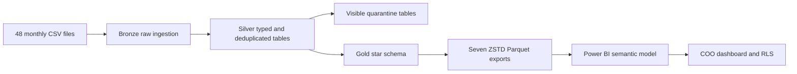

# Pinewood Senior Living Analytics

An end-to-end analytics solution for Pinewood Senior Living covering January
through June 2025. The project ingests 48 monthly source files from eight
operational domains, applies typed and auditable transformations in DuckDB,
publishes a Gold star schema, and presents executive KPIs in Power BI.

## Reviewer Quick Start

### View the completed report

1. Install [Power BI Desktop](https://powerbi.microsoft.com/desktop/).
2. Clone or download this repository.
3. Open `powerbi/Pinewood_COO_Dashboard.pbix`.
4. Open the **COO Overview** page and use the Region and Community slicers.

The PBIX contains imported data and can be reviewed without running Python.
Use the PBIP workflow below to inspect the version-controlled report/model
source or rebuild the data locally.

### Rebuild and verify everything locally

Run these commands from the repository root in Windows PowerShell:

```powershell
py -3.12 -m venv .venv
.\.venv\Scripts\Activate.ps1
python -m pip install --upgrade pip
python -m pip install -r requirements.txt
python -m pipeline.main
python -m pytest -q
```

Expected final messages include:

```text
Status            : SUCCESS
Silver status      : SUCCESS
Gold quality checks: SUCCESS
Gold status        : SUCCESS
31 passed
```

The pipeline is a deterministic full refresh. Re-running it replaces the local
tables and Parquet files without duplicating data.

## Architecture



DuckDB is the local analytical engine. SQL owns the transformation logic;
`pipeline/main.py` orchestrates source validation, execution, reconciliation,
quality checks, and exports.

## Repository Structure

```text
data/
	source/                 48 supplied CSV files and data dictionary
	output/                 generated DuckDB database and Gold Parquet files
pipeline/
	main.py                 one-command pipeline entry point
	sql/bronze/             reusable raw-ingestion SQL
	sql/silver/             typing, normalization, deduplication, quarantine
	sql/gold/               Gold dimensions and facts
powerbi/
	Pinewood_COO_Dashboard.pbix             ready-to-view report
	Pinewood_COO_Dashboard.pbip             PBIP project entry point
	Pinewood_COO_Dashboard.Report/          report source
	Pinewood_COO_Dashboard.SemanticModel/   TMDL model source
sql/
	gold_ddl.sql            standalone Gold schema DDL
	monthly_occupancy.sql   required occupancy query
	top_move_out_reasons.sql
	incident_rate.sql
tests/
	test_quality.py         focused parsing and normalization tests
	test_pipeline.py        integration and idempotency tests
requirements.txt
README.md
```

`data/output`, `.venv`, test caches, and Power BI local-state files are ignored
by Git because they are reproducible or machine-specific.

## Prerequisites

- Windows 10 or 11
- Python 3.12
- Power BI Desktop 2.158 or newer for PBIP editing
- Approximately 100 MB of free local disk space

Dependencies are pinned in `requirements.txt`: DuckDB 1.5.5 and pytest 9.1.1.

## Setup and Run Instructions

The repository includes all inputs under `data/source`. Rebuild every layer:

```powershell
.\.venv\Scripts\python.exe -m pipeline.main
```

The command verifies all source files, loads Bronze, builds Silver and visible
quarantine tables, validates Gold, and exports seven Parquet files.

Generated artifacts:

```text
data/output/pinewood.duckdb
data/output/gold/dim_date.parquet
data/output/gold/dim_community.parquet
data/output/gold/dim_care_level.parquet
data/output/gold/fact_resident_day.parquet
data/output/gold/fact_occupancy_monthly.parquet
data/output/gold/fact_lease.parquet
data/output/gold/fact_incident.parquet
```

## Data Layers

### Bronze

Bronze preserves source values and lineage. Eight domains reconcile to 80,027
rows:

| Source | Rows |
|---|---:|
| PCC residents | 4,152 |
| PCC incidents | 411 |
| PCC care history | 303 |
| Yardi units | 5,490 |
| Yardi leases | 346 |
| ADP shifts | 68,071 |
| Google Business Profile reviews | 424 |
| HubSpot leads | 830 |

### Silver and quarantine

Silver contains typed, normalized, and deduplicated records. Records that
cannot be selected safely are retained in quarantine instead of being silently
discarded.

| Quality result | Rows |
|---|---:|
| Conflicting resident records | 3 |
| Units with invalid community keys | 30 |
| Conflicting lead records | 2 |
| Incidents outside resident stay dates | 12 |
| Invalid acuity values flagged | 18 |
| Older lease versions removed | 44 |
| Invalid parsed ADP rates | 0 |

## Gold Star Schema and Fact Grains

| Table | Grain | Rows |
|---|---|---:|
| `gold.dim_date` | One calendar date | 181 |
| `gold.dim_community` | One community | 14 |
| `gold.dim_care_level` | One normalized care level | 3 |
| `gold.fact_resident_day` | One resident per active day | 120,533 |
| `gold.fact_occupancy_monthly` | One community per month | 84 |
| `gold.fact_lease` | One latest lease record | 302 |
| `gold.fact_incident` | One valid incident | 399 |

Automated checks enforce unique dimension keys, unique fact grains, valid
dimension references, nonzero occupancy denominators, 75 completed move-outs,
and readable Parquet exports.

## Business Metric Definitions

### Occupancy proxy

```text
month-end active residents / valid inventory units
```

This is intentionally labelled a proxy. The supplied data does not provide
complete occupied-unit status, shared-unit capacity, or lease coverage for all
residents.

### Incident rate

```text
valid incidents / resident-days * 100
```

Admission and discharge dates both contribute one resident-day. Incident care
level uses the latest care-history event on or before the incident date, with
the same-month resident snapshot as fallback.

### Trailing 90-day move-out rate

```text
completed move-outs / average daily census
```

Average daily census is resident-days divided by the number of dates in the
selected trailing window.

## Required SQL

The standalone SQL deliverables are under `sql/`:

| File | Output |
|---|---|
| `gold_ddl.sql` | Gold DDL, keys, constraints, and grain comments |
| `monthly_occupancy.sql` | 84 community-month occupancy rows |
| `top_move_out_reasons.sql` | 37 ranked rows, up to three per community |
| `incident_rate.sql` | 42 community/care-level rate rows |

After running the pipeline, preview all three analytical queries locally:

```powershell
@'
from pathlib import Path
import duckdb

connection = duckdb.connect("data/output/pinewood.duckdb", read_only=True)
for query_path in [
	Path("sql/monthly_occupancy.sql"),
	Path("sql/top_move_out_reasons.sql"),
	Path("sql/incident_rate.sql"),
]:
	rows = connection.execute(query_path.read_text()).fetchall()
	print(f"\n{query_path.name}: {len(rows)} rows")
	for row in rows[:5]:
		print(row)
connection.close()
'@ | .\.venv\Scripts\python.exe -
```

## Power BI Model

### Open the ready-to-view PBIX

Open `powerbi/Pinewood_COO_Dashboard.pbix`. The **COO Overview** page includes:

- Current occupancy proxy
- Trailing 90-day move-out rate
- Incidents per 100 resident-days
- Monthly occupancy trend and community comparison
- Incident rate by care level
- Top five completed move-out reasons
- Community performance matrix
- Region and community slicers

No resident-level identifiers are displayed.

### Open and refresh the PBIP project

1. Run the pipeline so `data/output/gold` contains all seven Parquet files.
2. Open `powerbi/Pinewood_COO_Dashboard.pbip` in Power BI Desktop.
3. Select **Home > Transform data > Edit parameters**.
4. Set `GoldFolderPath` to this clone's absolute `data\output\gold` path.
5. Select **Apply Changes**, then **Home > Refresh**.
6. Confirm that every visual renders without an error.

Example parameter value:

```text
C:\repos\Skypoint_Pinewood_FDE_Assessment\data\output\gold
```

The model imports only the seven named Parquet files. `GoldFiles` is a helper
Power Query expression and is not loaded into the model.

The semantic model contains ten active, single-direction, one-to-many
relationships:

- Community to all four fact tables
- Date to resident day, monthly occupancy, lease move-out date, and incident
	date
- Care level to resident day and incident

Technical IDs and implementation flags are hidden. The date table is marked as
a date table, and month and care-level labels use explicit sort columns.

## DAX Measures

- `Current Occupancy %`
- `Trailing 90-Day Move-Out Rate %`
- `Incident Rate per 100 Resident-Days`
- `Rolling 90-Day Incident Rate`
- `Completed Move-Outs`

Expected unfiltered checkpoints after refresh:

| Measure | Expected value |
|---|---:|
| Current occupancy | 82.09% |
| Trailing 90-day move-out rate | 7.49% |
| Incident rate per 100 resident-days | 0.3310 |
| Rolling 90-day incident rate | 0.3298 |

## Row-Level Security

Two static demonstration roles are included:

| Role | Filter | Occupancy checkpoint |
|---|---|---:|
| Regional Director | Pacific Northwest | 79.38% |
| Community Executive Director | Community C001 | 92.31% |

To test them, select **Modeling > View as**, choose one role, and verify that
all visuals filter consistently. A production deployment would map signed-in
users to authorized communities instead of using fixed demonstration filters.

## Anomalies Found

- Three resident IDs had conflicting source attributes and were quarantined.
- Thirty unit rows referenced invalid communities and were quarantined.
- Two lead IDs had conflicting records and were quarantined.
- Twelve incidents fell outside resident stay dates and were excluded from
	Gold incident metrics while remaining auditable in quarantine.
- Eighteen invalid acuity values were flagged without discarding residents.
- Forty-four older lease export versions were removed by latest-record logic.
- All 68,071 ADP hourly-rate values parsed safely; none were invalid.

## Testing and Reconciliation

Run the complete suite:

```powershell
.\.venv\Scripts\python.exe -m pytest -q
```

The 31 tests cover:

- Care-level normalization variants
- ISO and US date parsing
- Safe ADP dictionary parsing, including malicious-looking input
- Bronze, Silver, quarantine, and Gold reconciliation
- Dimension and fact-grain uniqueness
- Orphan-key detection and business benchmarks
- Required SQL result grains
- Parquet readability
- Full-pipeline idempotency

## Assumptions and Limitations

- Occupancy is a resident-based proxy, not confirmed occupied-unit occupancy.
- Admission and discharge dates are inclusive.
- Geography is a documented demonstration mapping because authoritative region
	metadata was not supplied:
	- C001-C005: Oregon / Pacific Northwest
	- C006-C009: Arizona / Southwest
	- C010-C014: Texas / South
- Static RLS roles demonstrate filter propagation; they are not a production
	identity-entitlement implementation.
- Generated DuckDB and Parquet outputs are excluded from Git and must be
	rebuilt before refreshing PBIP on another machine.

## Troubleshooting

### Pipeline reports missing source files

Confirm `data/source` contains 48 CSV files, six per source domain, plus
`DATA_DICTIONARY.md`.

### Power BI cannot find the Parquet files

Run `python -m pipeline.main`, then update `GoldFolderPath` to the new machine's
absolute `data\output\gold` path.

### PowerShell blocks virtual-environment activation

Activation is optional. Run the project interpreter directly:

```powershell
.\.venv\Scripts\python.exe -m pipeline.main
.\.venv\Scripts\python.exe -m pytest -q
```

## Recorded Walkthrough

Walkthrough link: **To be added before submission.**

## Author

Sourabh Mishra